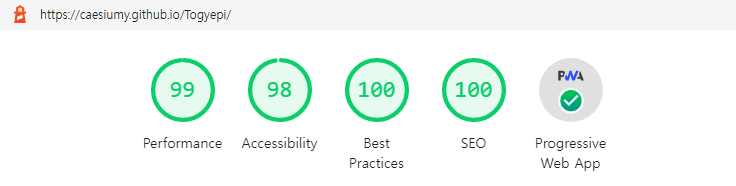
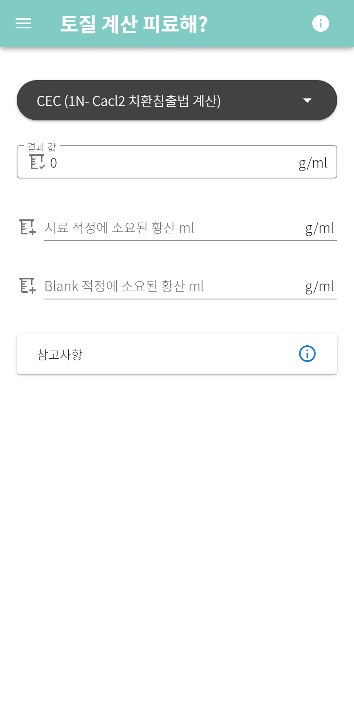
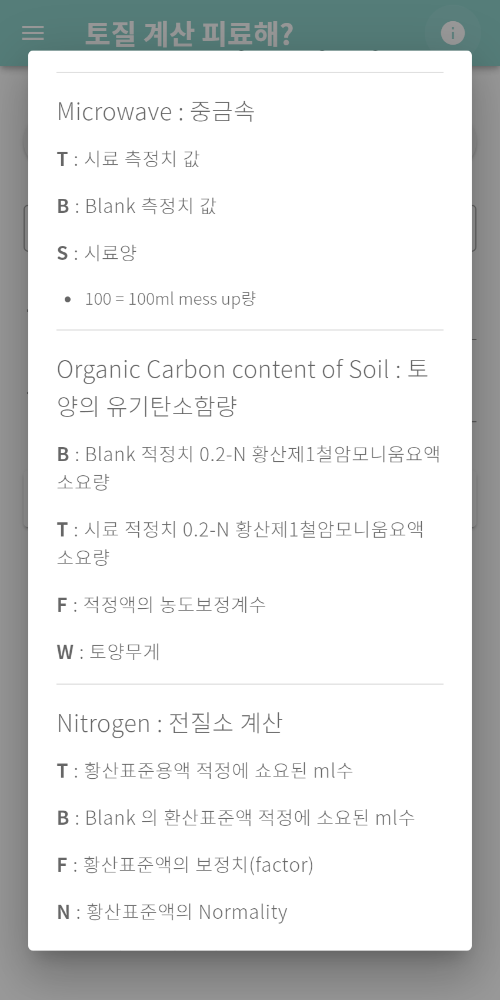
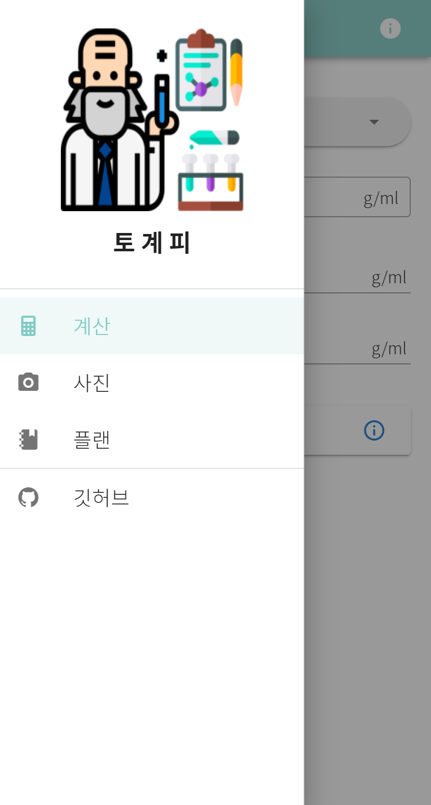
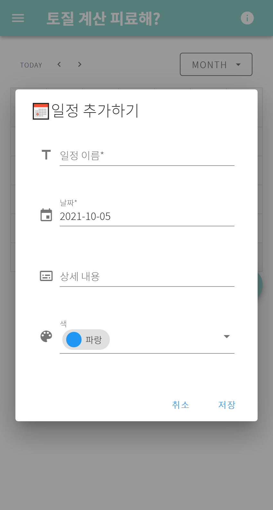

# 토계피 - 토질 계산 피료해?

미흡했던 이전을 벗어나 버전 2로 돌아온 토계피!

## 🔗배포 링크

https://caesiumy.github.io/Togyepi/

## 🌊Lighthouse

## 🎨기술 스택

- `Vue`
- `Vuetify`
- `PWA`

## 📷스크린샷(Mobile L)

  
홈

  

  
계산기

  

  
계산 공식 정보

  

  
메뉴

  

  
사진과 캔버스

  

  
계획

  

  
계획 추가 모달

  

